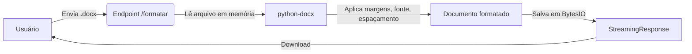

```markdown
# Guia para Criar uma API de Formatação ABNT com FastAPI e python-docx

Este guia descreve o passo a passo para construir uma API REST que recebe um arquivo `.docx`, aplica as regras de formatação da ABNT (NBR 14724) e devolve o documento pronto para download.

**Foco:** Apenas a construção da lógica e da API. A implantação em VPS/servidores não está coberta aqui.

---

## 📋 Pré-requisitos

Antes de começar, certifique-se de ter instalado:

- Python 3.8 ou superior.
- Pip (gerenciador de pacotes do Python).
- (Opcional) Um ambiente virtual (`venv`) para isolar as dependências.

---

## 📁 Estrutura do Projeto

Organize os arquivos da seguinte forma no seu diretório de trabalho:

```text
formatador_api/
├── app/
│   ├── __init__.py
│   ├── main.py          # Endpoints e configuração da API
│   └── formatter.py     # Lógica de formatação ABNT
└── requirements.txt     # Dependências do projeto
```

---

## ⚙️ Passo 1: Dependências (requirements.txt)

Crie o arquivo `requirements.txt` com as bibliotecas necessárias:

```txt
fastapi==0.115.6
uvicorn[standard]==0.34.0
python-docx==1.1.2
python-multipart==0.0.20
```

Instale todas com o comando:

```bash
pip install -r requirements.txt
```

---

## 🧠 Passo 2: Lógica de Formatação (formatter.py)

Este arquivo contém a função que manipula diretamente o documento `.docx` usando a biblioteca `python-docx`.

```python
from docx import Document
from docx.shared import Inches, Pt
from docx.enum.text import WD_ALIGN_PARAGRAPH


def formatar_abnt(doc: Document):
    """
    Aplica as principais regras ABNT diretamente no objeto Document.
    Atenção: Não altera o conteúdo textual, apenas estilos e layout.
    """

    # 1. Configuração das Margens (Superior/Esquerda: 3cm, Inferior/Direita: 2cm)
    secao = doc.sections[0]
    secao.top_margin = Inches(1.18)    # Aproximadamente 3 cm
    secao.left_margin = Inches(1.18)
    secao.bottom_margin = Inches(0.79) # Aproximadamente 2 cm
    secao.right_margin = Inches(0.79)

    # 2. Formatação dos Parágrafos
    for paragrafo in doc.paragraphs:
        # Alinhamento justificado
        paragrafo.alignment = WD_ALIGN_PARAGRAPH.JUSTIFY

        # Espaçamento entre linhas: 1.5
        paragrafo.paragraph_format.line_spacing = 1.5

        # Fonte Arial, tamanho 12 para todos os trechos (runs)
        for run in paragrafo.runs:
            run.font.name = 'Arial'
            run.font.size = Pt(12)

    # (Opcional) Lógica para Títulos:
    # Se você usa estilos 'Heading 1', 'Heading 2', etc., pode tratá-los aqui.
    # Exemplo:
    # for paragrafo in doc.paragraphs:
    #     if 'Heading' in paragrafo.style.name:
    #         for run in paragrafo.runs:
    #             run.bold = True
    #             run.font.size = Pt(14)
```

---

## 🌐 Passo 3: Endpoint da API (main.py)

Aqui criamos o servidor FastAPI e o endpoint `/formatar` que recebe o arquivo, processa e retorna o documento formatado.

```python
from fastapi import FastAPI, UploadFile, File, HTTPException
from fastapi.responses import StreamingResponse
from docx import Document
import io
import os

from app.formatter import formatar_abnt

# Inicializa a aplicação FastAPI
app = FastAPI(
    title="Formatador ABNT API",
    description="API para formatar documentos .docx nas normas ABNT",
    version="1.0.0"
)


@app.post("/formatar")
async def formatar_documento(file: UploadFile = File(...)):
    """
    Endpoint que recebe um arquivo .docx, aplica a formatação ABNT
    e retorna o arquivo modificado para download.
    """

    # 1. Validação da extensão do arquivo
    if not file.filename.endswith(('.docx', '.doc')):
        raise HTTPException(
            status_code=400,
            detail="Apenas arquivos com extensão .docx ou .doc são permitidos."
        )

    try:
        # 2. Leitura do arquivo enviado (em memória)
        conteudo = await file.read()
        doc = Document(io.BytesIO(conteudo))

        # 3. Aplica a formatação ABNT
        formatar_abnt(doc)

        # 4. Salva o documento formatado em um buffer de memória (BytesIO)
        output = io.BytesIO()
        doc.save(output)
        output.seek(0)  # Volta o ponteiro para o início do arquivo

        # 5. Define o nome do arquivo de saída
        nome_base = os.path.splitext(file.filename)[0]
        nome_saida = f"{nome_base}_formatado.docx"

        # 6. Retorna o arquivo via StreamingResponse (não salva no disco)
        return StreamingResponse(
            output,
            media_type="application/vnd.openxmlformats-officedocument.wordprocessingml.document",
            headers={
                "Content-Disposition": f"attachment; filename={nome_saida}"
            }
        )

    except Exception as e:
        raise HTTPException(
            status_code=500,
            detail=f"Erro ao processar o arquivo: {str(e)}"
        )


# (Opcional) Endpoint de saúde para verificar se a API está no ar
@app.get("/")
async def root():
    return {"mensagem": "API de Formatação ABNT está funcionando!"}
```

---

## ▶️ Passo 4: Executar e Testar Localmente

Com todos os arquivos criados, execute o servidor de desenvolvimento com o comando:

```bash
uvicorn app.main:app --reload
```

A API estará disponível em `http://127.0.0.1:8000`.

**Documentação automática:**

- Acesse `http://127.0.0.1:8000/docs` para a interface interativa do Swagger.
- Acesse `http://127.0.0.1:8000/redoc` para a documentação alternativa em ReDoc.

**Teste prático:**

1. Na interface `/docs`, localize o endpoint `POST /formatar`.
2. Clique em "Try it out".
3. Selecione um arquivo `.docx` no seu computador.
4. Clique em "Execute".
5. O navegador fará o download do arquivo formatado automaticamente.

---

## 🔄 Resumo do Fluxo da API



**Principais vantagens dessa abordagem:**
- **Não altera o texto:** Apenas propriedades visuais (layout) são modificadas.
- **Não salva arquivos no servidor:** Tudo processado na memória RAM, aumentando a segurança e reduzindo a necessidade de limpeza de arquivos temporários.
- **Rápido e escalável:** Leve e fácil de integrar com outras aplicações.

---

## 🚀 Próximos Passos (Sugestões de Melhoria)

1. **Capa Automática:** Receber dados (instituição, autor, título) via JSON junto com o arquivo e inserir uma capa formatada.
2. **Sumário:** Inserir um campo de sumário automático (TOC) do Word no início do documento.
3. **Estilos de Título:** Ajustar automaticamente os títulos (`Heading 1`, `Heading 2`) para negrito, tamanhos específicos e alinhamento centralizado.
4. **Validação Estrutural:** Verificar se o documento segue a estrutura mínima (resumo, introdução, etc.) antes de formatar.

---
