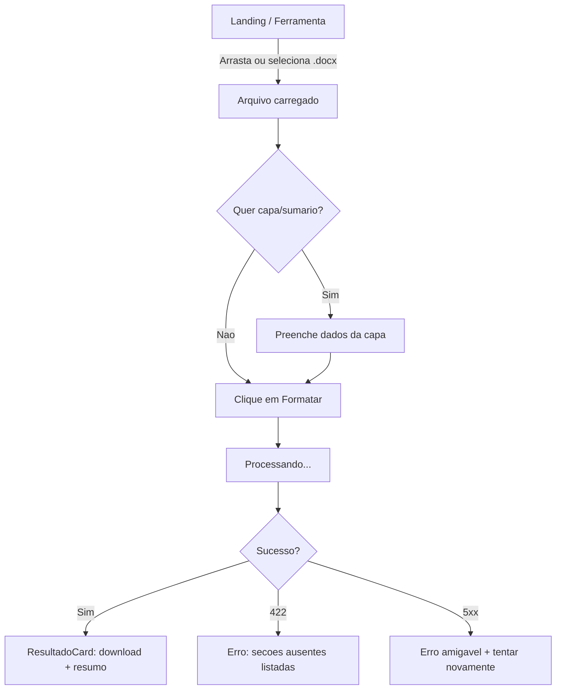
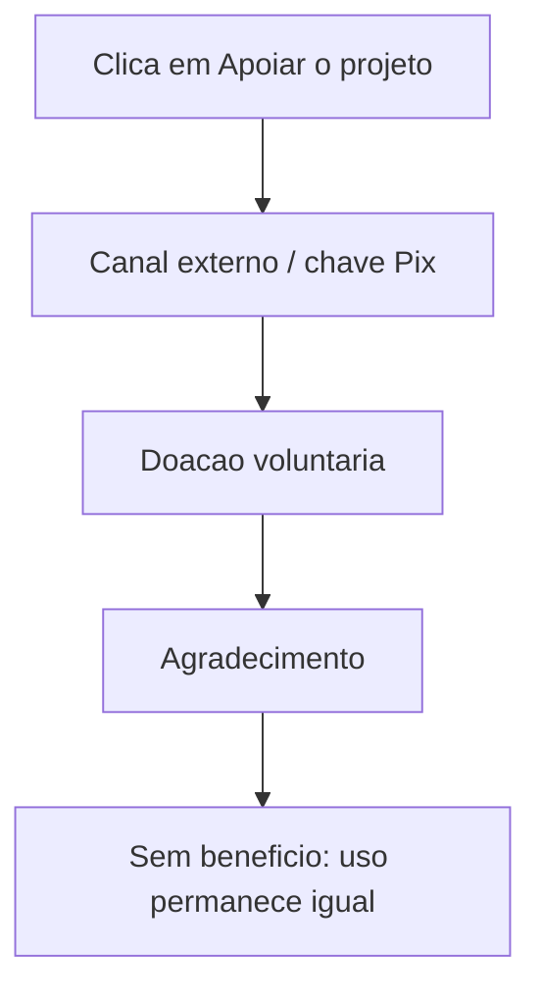

# Fluxos de UX

> Nao existe cota de negocio nem pagamento: o uso e gratuito e ilimitado. O unico
> 429 possivel vem do rate limit tecnico anti-flood na borda.

## Fluxo 1: Formatacao livre



### Estados da Tela (publico)
| Estado | Gatilho | Comportamento |
|--------|---------|---------------|
| Vazio | Nenhum arquivo | Dropzone em destaque, botao desabilitado |
| Arquivo carregado | Selecao valida | Mostrar nome/tamanho, habilitar opcoes |
| Arquivo invalido | Extensao/tamanho | Alerta de erro, remover arquivo |
| Enviando | Clique em Formatar | Barra de progresso de upload |
| Processando | Upload concluido | Spinner + texto "Aplicando normas ABNT" |
| Sucesso | 200 | Download automatico + resumo do que foi aplicado |
| Erro de estrutura | 422 | Lista de secoes ausentes + opcao "baixar mesmo assim" |
| Rate limit tecnico | 429 | Aviso temporario "muitas requisicoes, tente em instantes" |
| Erro interno | 5xx | Mensagem amigavel + botao "Tentar novamente" |

## Fluxo 2: Doacao (apoio ao projeto)



### Estados do Apoio
| Estado | Gatilho | Comportamento |
|--------|---------|---------------|
| Convite | Rodape/secao de apoio | Botao discreto "Apoiar o projeto" |
| Redirecionamento | Clique | Abre o canal de doacao configurado |
| Retorno | Apos doar | Sem alteracao no uso; apenas agradecimento |

## Fluxo 3: Acesso ao painel admin minimo

```mermaid
graph TD
    A[/admin] --> B{Chave X-Admin-Key valida?}
    B -->|Nao| C[401 - campo de chave]
    B -->|Sim| D[Dashboard: metricas de uso]
    D --> E[Documentos/dia e taxa de erro]
```

### Estados da Tela (admin)
| Estado | Gatilho | Comportamento |
|--------|---------|---------------|
| Sem chave | Acesso inicial | Campo de chave, sem dados exibidos |
| Chave invalida | 401 | Mensagem generica + limpar campo |
| Carregando | Busca metricas | Skeleton nos KPI cards |
| Sem dados | Periodo sem uso | Cards zerados + mensagem |
| Erro | Falha na API | Alerta + botao "Tentar novamente" |
