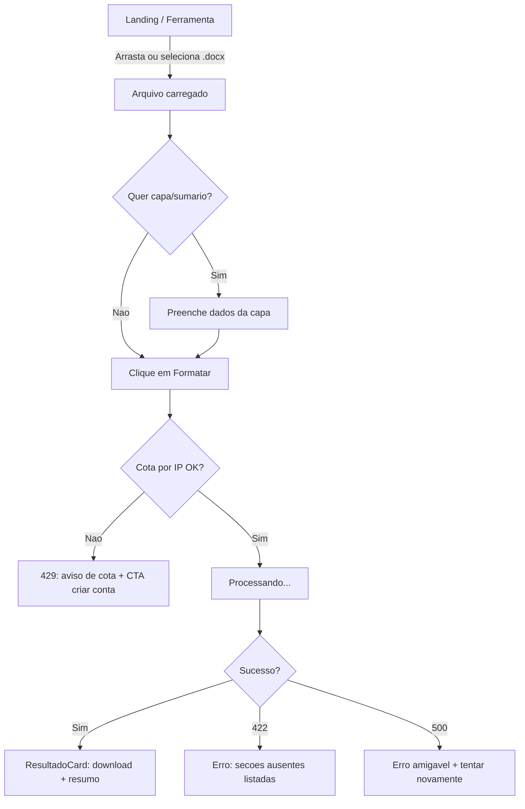
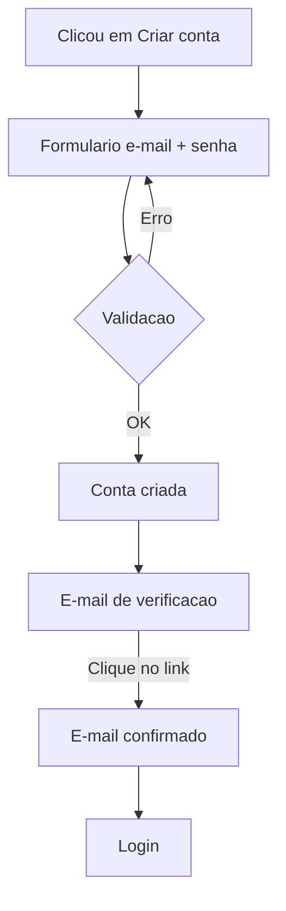
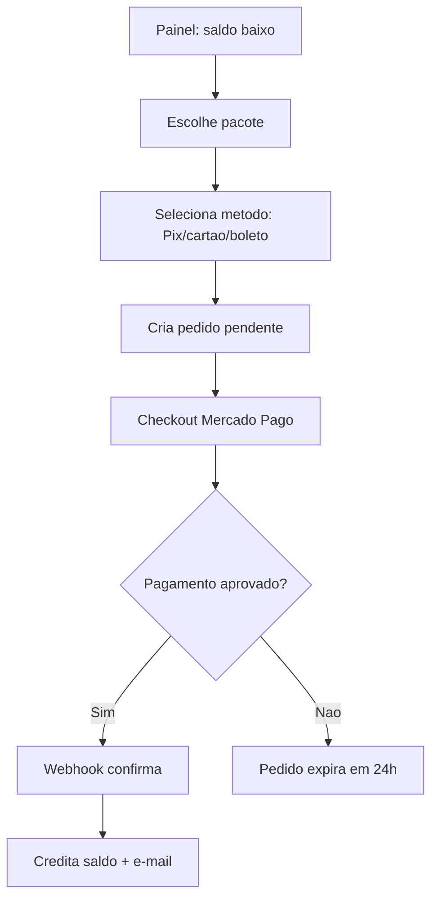
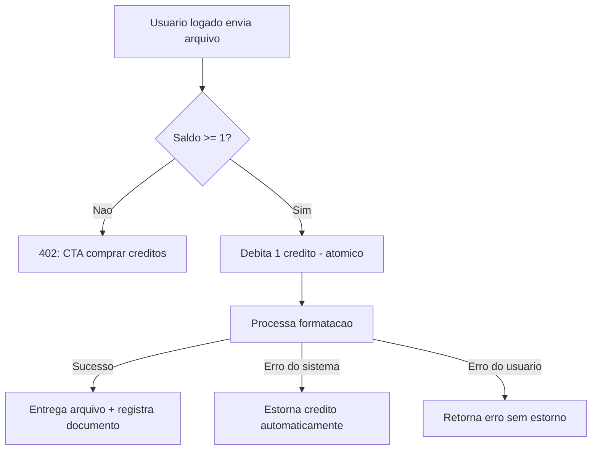
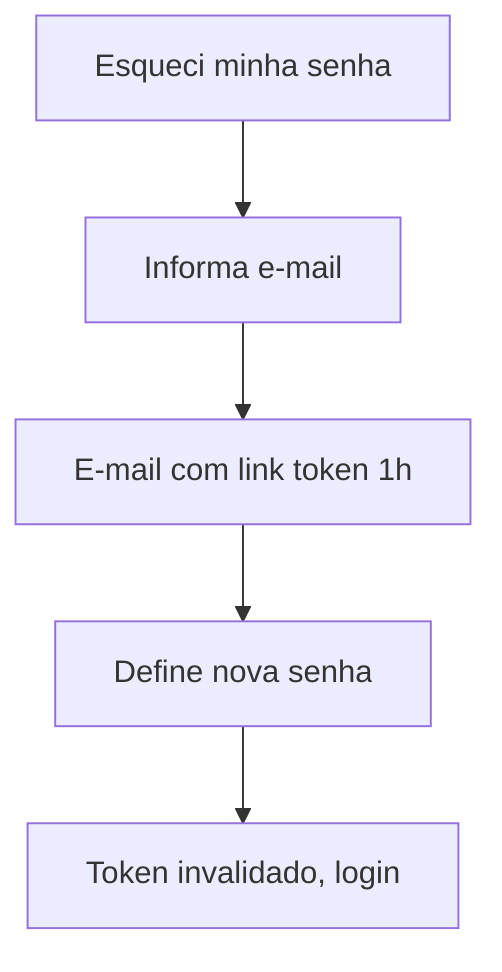
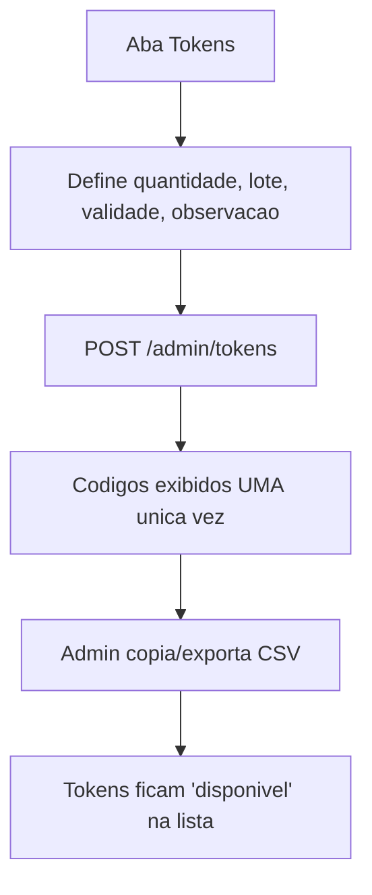
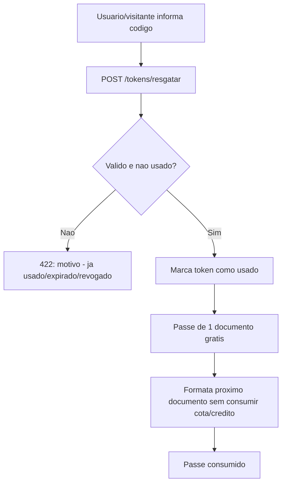

# Fluxos de UX

## Fluxo 1: Formatacao anonima (F1 - MVP)



### Estados da Tela (F1)
| Estado | Gatilho | Comportamento |
|--------|---------|---------------|
| Vazio | Nenhum arquivo | Dropzone em destaque, botao desabilitado |
| Arquivo carregado | Selecao valida | Mostrar nome/tamanho, habilitar opcoes |
| Arquivo invalido | Extensao/tamanho | Alerta de erro, remover arquivo |
| Enviando | Clique em Formatar | Barra de progresso de upload |
| Processando | Upload concluido | Spinner + texto "Aplicando normas ABNT" |
| Sucesso | 200 | Download automatico + resumo do que foi aplicado |
| Erro de estrutura | 422 | Lista de secoes ausentes + opcao "baixar mesmo assim" (sem validar) |
| Cota excedida | 429 | Aviso com CTA "Criar conta" / "Comprar creditos" |
| Erro interno | 5xx | Mensagem amigavel + botao "Tentar novamente" |

## Fluxo 2: Criacao de conta (F2)



## Fluxo 3: Compra de creditos (F2)



### Estados da Tela (F2 - Checkout)
| Estado | Gatilho | Comportamento |
|--------|---------|---------------|
| Selecao | Entrou em /pacotes | Cards com preco e creditos |
| Aguardando pagamento | Pix gerado | QR Code + copia-e-cola + polling de status |
| Processando | Cartao em analise | Mensagem "Aguardando confirmacao" |
| Aprovado | Webhook `approved` | Saldo atualizado + toast de sucesso |
| Rejeitado | Webhook `rejected` | Mensagem + opcao de tentar outro metodo |
| Expirado | 24h sem pagamento | Pedido cancelado, CTA refazer compra |

## Fluxo 4: Formatacao autenticada com debito (F2)



## Fluxo 5: Recuperacao de senha (F2)



## Fluxo 6: Acesso ao painel admin (F2)

```mermaid
graph TD
    A[/admin/login] --> B{Credenciais validas?}
    B -->|Nao| A
    B -->|Sim| C{papel == admin?}
    C -->|Nao| D[403 - volta ao site]
    C -->|Sim| E[Dashboard: uso + faturamento]
    E --> F[Aba Tokens]
    E --> G[Aba Usuarios]
```

### Estados da Tela (admin)
| Estado | Gatilho | Comportamento |
|--------|---------|---------------|
| Sem permissao | papel != admin | 403 + link para o site |
| Carregando | Busca metricas | Skeleton nos KPI cards |
| Sem dados | Periodo sem uso | Cards zerados + mensagem |
| Erro | Falha na API | Alerta + botao "Tentar novamente" |

## Fluxo 7: Criacao de tokens (F2 - admin)



## Fluxo 8: Resgate de token e uso gratuito (F2)



### Estados do Resgate
| Estado | Gatilho | Comportamento |
|--------|---------|---------------|
| Vazio | Nenhum codigo | Campo desabilitado para envio |
| Validando | Clique em Resgatar | Spinner curto |
| Sucesso | 200 | Mensagem "1 documento gratis liberado" |
| Erro | 422 | Motivo claro e campo limpo |
| Passe ativo | Apos sucesso | Badge persistente ate usar ou expirar |
