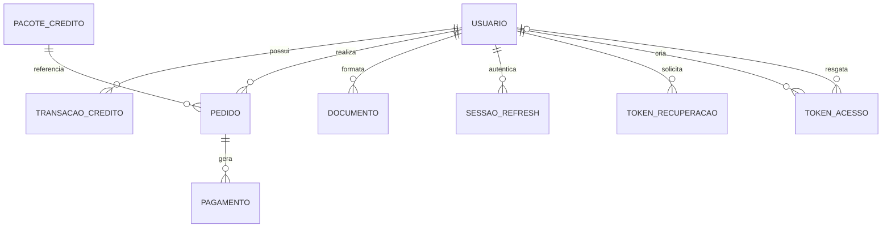

# Modelo de Dados

> Banco: PostgreSQL (F2+). O nucleo de formatacao (F1) **nao** persiste documentos.
> Todo consumo/pagamento passa por um ledger imutavel de creditos.

## Diagrama Entidade-Relacionamento

## Entidades

### USUARIO
| Coluna | Tipo | Restricoes | Descricao |
|--------|------|-----------|-----------|
| id | uuid | PK, default gen_random_uuid() | Identificador unico |
| email | varchar(255) | NOT NULL, UNIQUE (lower) | Login do usuario |
| senha_hash | varchar(255) | NOT NULL | Hash bcrypt/argon2 |
| nome | varchar(150) | NULL | Nome de exibicao |
| email_verificado | boolean | NOT NULL, default false | Confirmacao de e-mail |
| papel | varchar(20) | NOT NULL, default 'usuario' | usuario, admin |
| saldo_creditos | integer | NOT NULL, default 0, CHECK >= 0 | Cache do saldo (fonte: ledger) |
| status | varchar(20) | NOT NULL, default 'ativo' | ativo, suspenso, excluido |
| created_at | timestamptz | NOT NULL, default now() | Criacao |
| updated_at | timestamptz | NOT NULL, default now() | Atualizacao |

**Indices**: `uq_usuario_email` (unicidade de login).

### SESSAO_REFRESH
| Coluna | Tipo | Restricoes | Descricao |
|--------|------|-----------|-----------|
| id | uuid | PK | Identificador da sessao |
| usuario_id | uuid | FK -> usuario.id, NOT NULL | Dono da sessao |
| token_hash | varchar(255) | NOT NULL | Hash do refresh token |
| expira_em | timestamptz | NOT NULL | Expiracao |
| revogado | boolean | NOT NULL, default false | Revogacao manual |
| created_at | timestamptz | NOT NULL, default now() | Criacao |

**Indices**: `idx_sessao_usuario` em usuario_id.

### TOKEN_RECUPERACAO
| Coluna | Tipo | Restricoes | Descricao |
|--------|------|-----------|-----------|
| id | uuid | PK | Identificador |
| usuario_id | uuid | FK -> usuario.id, NOT NULL | Dono |
| token_hash | varchar(255) | NOT NULL | Hash do token |
| expira_em | timestamptz | NOT NULL | Expiracao (ex.: 1h) |
| usado | boolean | NOT NULL, default false | Uso unico |
| created_at | timestamptz | NOT NULL, default now() | Criacao |

### TOKEN_ACESSO
| Coluna | Tipo | Restricoes | Descricao |
|--------|------|-----------|-----------|
| id | uuid | PK | Identificador |
| codigo_hash | varchar(255) | NOT NULL, UNIQUE | Hash do codigo (nunca o codigo puro) |
| prefixo | varchar(12) | NOT NULL | Prefixo visivel para suporte (ex.: `AB12`) |
| lote | varchar(50) | NULL | Rotulo do lote de geracao |
| observacao | varchar(255) | NULL | Destinatario/motivo do token |
| criado_por | uuid | FK -> usuario.id, NOT NULL | Admin que gerou |
| usado_por | uuid | FK -> usuario.id, NULL | Usuario que resgatou (NULL se anonimo) |
| resgatado_ip | inet | NULL | IP do resgate anonimo |
| beneficio | varchar(20) | NOT NULL, default 'documento' | documento (1 formatacao gratis) |
| status | varchar(20) | NOT NULL, default 'disponivel' | disponivel, usado, expirado, revogado |
| expira_em | timestamptz | NOT NULL | Expiracao (padrao 90 dias) |
| usado_em | timestamptz | NULL | Data do resgate |
| created_at | timestamptz | NOT NULL, default now() | Criacao |

**Indices**: `uq_token_codigo_hash` (unicidade); `idx_token_status` em status;
`idx_token_lote` em lote.

### AUDITORIA_ADMIN
| Coluna | Tipo | Restricoes | Descricao |
|--------|------|-----------|-----------|
| id | uuid | PK | Identificador |
| admin_id | uuid | FK -> usuario.id, NOT NULL | Admin autor |
| acao | varchar(60) | NOT NULL | Ex.: token.criar, saldo.ajustar |
| alvo_tipo | varchar(40) | NULL | Entidade alvo |
| alvo_id | uuid | NULL | Id do alvo |
| detalhe | jsonb | NULL | Payload da acao |
| created_at | timestamptz | NOT NULL, default now() | Data |

**Indices**: `idx_auditoria_admin_data` em (admin_id, created_at DESC).

### PACOTE_CREDITO
| Coluna | Tipo | Restricoes | Descricao |
|--------|------|-----------|-----------|
| id | uuid | PK | Identificador |
| nome | varchar(100) | NOT NULL | Nome do pacote |
| creditos | integer | NOT NULL, CHECK > 0 | Quantidade de creditos |
| preco_centavos | integer | NOT NULL, CHECK > 0 | Preco em centavos (BRL) |
| ativo | boolean | NOT NULL, default true | Disponivel para compra |
| ordem | integer | NOT NULL, default 0 | Ordenacao na UI |
| created_at | timestamptz | NOT NULL, default now() | Criacao |

### PEDIDO
| Coluna | Tipo | Restricoes | Descricao |
|--------|------|-----------|-----------|
| id | uuid | PK | Identificador |
| usuario_id | uuid | FK -> usuario.id, NOT NULL | Comprador |
| pacote_id | uuid | FK -> pacote_credito.id, NOT NULL | Pacote |
| creditos | integer | NOT NULL | Creditos no momento da compra |
| preco_centavos | integer | NOT NULL | Preco travado no momento da compra |
| status | varchar(20) | NOT NULL, default 'pendente' | pendente, pago, expirado, cancelado |
| expira_em | timestamptz | NOT NULL | Expiracao do pedido (24h) |
| created_at | timestamptz | NOT NULL, default now() | Criacao |

**Indices**: `idx_pedido_usuario` em usuario_id; `idx_pedido_status` em status.

### PAGAMENTO
| Coluna | Tipo | Restricoes | Descricao |
|--------|------|-----------|-----------|
| id | uuid | PK | Identificador |
| pedido_id | uuid | FK -> pedido.id, NOT NULL | Pedido |
| metodo | varchar(20) | NOT NULL | pix, cartao, boleto |
| status | varchar(20) | NOT NULL | pending, approved, rejected, refunded |
| mp_payment_id | varchar(64) | UNIQUE, NULL | Id no Mercado Pago (idempotencia) |
| valor_centavos | integer | NOT NULL | Valor pago |
| payload | jsonb | NULL | Resposta bruta do MP (auditoria) |
| created_at | timestamptz | NOT NULL, default now() | Criacao |
| updated_at | timestamptz | NOT NULL, default now() | Atualizacao |

**Indices**: `uq_pagamento_mp_id` (unicidade -> idempotencia RN041).

### TRANSACAO_CREDITO (ledger imutavel)
| Coluna | Tipo | Restricoes | Descricao |
|--------|------|-----------|-----------|
| id | uuid | PK | Identificador |
| usuario_id | uuid | FK -> usuario.id, NOT NULL | Dono |
| tipo | varchar(20) | NOT NULL | compra, consumo, estorno, ajuste |
| quantidade | integer | NOT NULL | Positivo (credito) ou negativo (debito) |
| saldo_apos | integer | NOT NULL | Saldo resultante |
| documento_id | uuid | FK -> documento.id, NULL | Referencia do consumo |
| pedido_id | uuid | FK -> pedido.id, NULL | Referencia da compra |
| descricao | varchar(255) | NULL | Texto para o extrato |
| created_at | timestamptz | NOT NULL, default now() | Data do lancamento |

**Indices**: `idx_ledger_usuario_data` em (usuario_id, created_at DESC).
**Relacionamentos**: `USUARIO 1..N TRANSACAO_CREDITO` (extrato/saldo).

### DOCUMENTO (apenas metadados)
| Coluna | Tipo | Restricoes | Descricao |
|--------|------|-----------|-----------|
| id | uuid | PK | Identificador |
| usuario_id | uuid | FK -> usuario.id, NOT NULL | Dono |
| nome_arquivo | varchar(255) | NOT NULL | Nome original (sem conteudo) |
| tamanho_bytes | integer | NOT NULL | Tamanho do upload |
| incluir_capa | boolean | NOT NULL, default false | Opcao usada |
| incluir_sumario | boolean | NOT NULL, default false | Opcao usada |
| validar | boolean | NOT NULL, default false | Opcao usada |
| status | varchar(20) | NOT NULL | processando, concluido, erro |
| erro_mensagem | varchar(500) | NULL | Detalhe em caso de erro |
| formato_saida | varchar(10) | NOT NULL, default 'docx' | Formato entregue |
| created_at | timestamptz | NOT NULL, default now() | Criacao |

**Indices**: `idx_documento_usuario_data` em (usuario_id, created_at DESC).

## Notas de Integridade
- `usuario.saldo_creditos` e um **cache**; a verdade contabil e o somatorio do ledger.
  Atualizacoes de saldo e insercao no ledger devem ocorrer na **mesma transacao**.
- Toda operacao de credito usa `SELECT ... FOR UPDATE` no usuario para evitar corrida.
- `documento` nunca guarda o arquivo nem o texto — apenas metadados (LGPD, RNF020/021).
