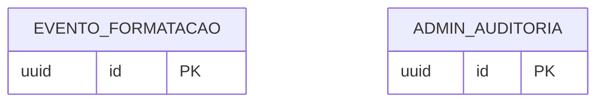

# Modelo de Dados

> Banco: PostgreSQL (uso minimo). O nucleo de formatacao **nao** persiste documentos.
> Nao ha cadastro de usuarios, perfis, cota, pagamentos ou tokens.
> O sistema **nao** processa doacoes: elas acontecem em canal externo.

## Diagrama Entidade-Relacionamento

## Entidades

### EVENTO_FORMATACAO (metricas anonimas)
| Coluna | Tipo | Restricoes | Descricao |
|--------|------|-----------|-----------|
| id | uuid | PK, default gen_random_uuid() | Identificador |
| ip_hash | varchar(64) | NOT NULL | Hash do IP (nunca o IP puro) |
| resultado | varchar(20) | NOT NULL | sucesso, erro, estrutura_invalida |
| duracao_ms | integer | NULL | Tempo de processamento |
| tamanho_bytes | integer | NULL | Tamanho do upload |
| created_at | timestamptz | NOT NULL, default now() | Data do evento |

**Indices**: `idx_evento_data` em created_at DESC.

### ADMIN_AUDITORIA
| Coluna | Tipo | Restricoes | Descricao |
|--------|------|-----------|-----------|
| id | uuid | PK | Identificador |
| acao | varchar(60) | NOT NULL | Ex.: login.ok, login.falha, metricas.consultar |
| alvo_tipo | varchar(40) | NULL | Entidade alvo |
| alvo_id | uuid | NULL | Id do alvo |
| detalhe | jsonb | NULL | Payload da acao |
| created_at | timestamptz | NOT NULL, default now() | Data |

**Indices**: `idx_auditoria_data` em created_at DESC.

## Notas de Integridade
- **Sem cadastro de usuarios**: nao existem tabelas `usuario`, `sessao_refresh`,
  `token_recuperacao`, `pacote_credito`, `transacao_credito` nem `documento`.
- **Sem pagamentos/tokens**: nao existem `pedido_token`, `pagamento` nem `token_acesso`.
- **Sem cota no banco**: nao ha contagem de requisicoes; o rate limit tecnico fica na borda.
- **Doacoes fora do sistema**: nenhuma tabela financeira; o canal de doacao e externo.
- `EVENTO_FORMATACAO` guarda apenas metadados anonimos (IP na forma de hash), nunca o conteudo.
