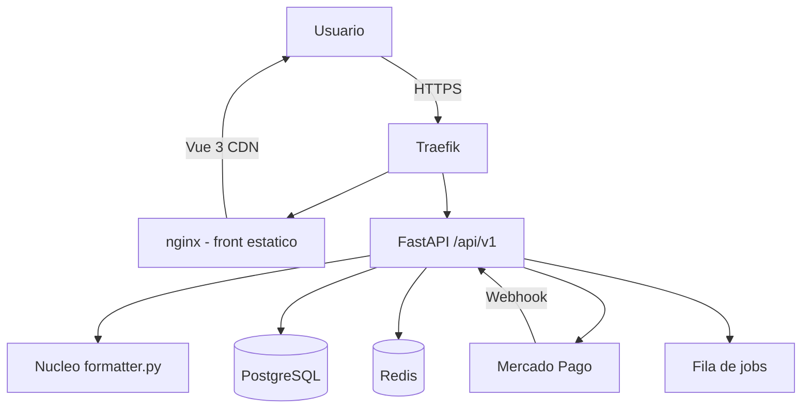

# Visao Geral: Formata ABNT (SaaS)

## Proposito
O **Formata ABNT** e um SaaS web que formata automaticamente documentos academicos
(`.docx`) segundo as normas ABNT, sem exigir que o usuario saiba usar estilos,
margens ou sumario do Word. O publico-alvo primario sao estudantes de graduacao e
pos-graduacao que precisam entregar TCC, monografia, dissertacao ou artigo dentro
da norma, e o publico secundario sao faculdades e editoras que querem oferecer o
servico aos seus alunos pelo proprio site.

O nucleo de formatacao ja existe como API FastAPI (`app/main.py`,
`app/formatter.py`). Este documento descreve a evolucao para produto SaaS com
ferramenta web, contas, creditos e cobranca pay-per-use.

## Decisoes de Produto (definidas com o usuario)
- **Monetizacao**: creditos pay-per-use (pacotes de creditos, sem assinatura).
- **Frontend**: Vue 3 via CDN + Bootstrap 5.3 (paginas estaticas, sem build).
- **Auth**: propria, via JWT (access + refresh).
- **Pagamento**: Mercado Pago (Pix, cartao e boleto).
- **Canal**: acesso **somente pelo site**; nao ha API publica para terceiros.
- **Administracao**: papel `admin` no mesmo login, com painel de uso, faturamento e tokens.
- **Tokens de acesso**: codigos de uso unico (1 documento gratis) gerados pelo admin.
- **MVP (Fase 1)**: apenas a ferramenta web publica, **sem login**.
  Contas, creditos e cobranca entram nas fases seguintes.
- **Backend**: FastAPI (reaproveitado do projeto atual).
- **Banco**: PostgreSQL (introduzido a partir da Fase 2).
- **Deploy**: Docker Swarm + Traefik + nginx.

## Stack Definida
| Camada | Tecnologia | Justificativa |
|--------|-----------|---------------|
| Frontend | Vue 3 (CDN) + Bootstrap 5.3 | Ja e padrao do usuario; sem pipeline de build; servido por nginx |
| Backend | Python + FastAPI | Nucleo de formatacao ja implementado e stateless |
| Banco | PostgreSQL | Confiavel, transacional (ledger de creditos), convencao do usuario |
| Cache/Fila | Redis | Cota anonima por IP, rate limit e jobs de arquivos grandes |
| Auth | JWT proprio (access + refresh) | Sem vendor lock-in; controle de sessoes |
| Pagamento | Mercado Pago (Checkout Pro / Orders) | Melhor adesao no Brasil (Pix/boleto/cartao) |
| Deploy | Docker Swarm + Traefik + nginx | Infra ja operada pelo usuario |

## Diagrama de Arquitetura


## Estrutura de Pastas Prevista
```
/
├── app/                    # backend FastAPI (existente, evolui aqui)
│   ├── main.py
│   ├── formatter.py
│   ├── core/               # config, seguranca, dependencias
│   ├── models/             # SQLAlchemy (Fase 2)
│   ├── schemas/            # Pydantic
│   ├── routers/            # formatar, auth, creditos, pagamentos, tokens, admin
│   ├── services/           # regras de negocio, Mercado Pago, fila
│   └── workers/            # consumo de fila (Fase 3)
├── frontend/               # paginas Vue 3 CDN + Bootstrap
│   ├── index.html          # ferramenta publica (MVP)
│   ├── assets/
│   └── painel/             # area logada (Fase 2)
├── docs/
│   ├── index.md
│   └── specs/
├── deploy/                 # docker-compose, nginx.conf, traefik labels
├── requirements.txt
└── .env.example
```

## Fases (resumo)
| Fase | Entrega | Login? | Cobranca? |
|------|---------|--------|-----------|
| 1 — MVP | Ferramenta web publica de formatacao | Nao | Nao |
| 2 — Conta + Creditos | Cadastro, saldo, historico, Mercado Pago, admin e tokens | Sim | Sim |
| 3 — Escala | Fila de jobs, admin e observabilidade | Sim | Sim |

Detalhamento em `roadmap.md`.
