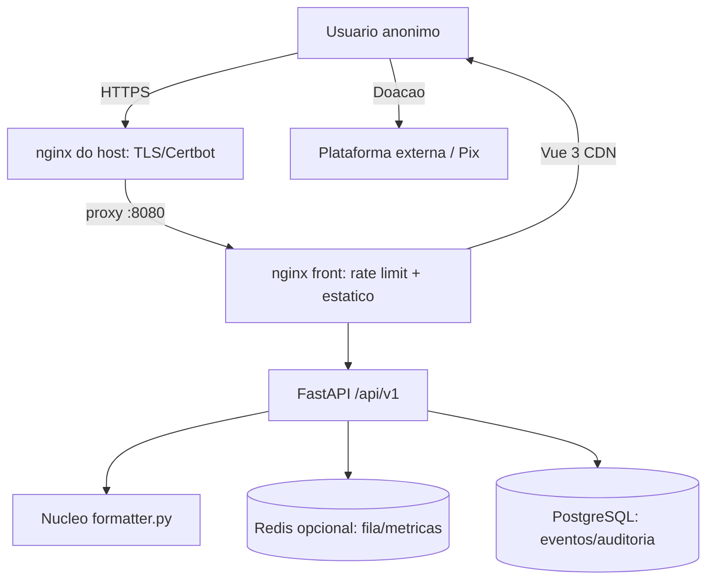

# Visao Geral: Formata ABNT (Open Source)

## Proposito
O **Formata ABNT** e uma ferramenta **open source** que formata automaticamente
documentos academicos (`.docx`) segundo as normas ABNT, sem exigir que o usuario
saiba usar estilos, margens ou sumario do Word. O publico-alvo primario sao
estudantes de graduacao e pos-graduacao que precisam entregar TCC, monografia,
dissertacao ou artigo dentro da norma.

O projeto e aberto e mantido pela comunidade. O uso e **gratuito e ilimitado**,
**sem login** e **sem perfis de usuario**. A unica forma de arrecadacao sao
**doacoes voluntarias**. Contra abuso, existe apenas um **rate limit tecnico na
borda** (anti-flood), que nao e cota de negocio.

O nucleo de formatacao ja existe como API FastAPI (`app/main.py`,
`app/formatter.py`). Este documento descreve o produto nesse modelo.

## Modelo de Produto (definido com o usuario)
- **Licenca**: open source (licenca exata a definir no roadmap; sugestao MIT ou AGPL-3.0).
- **Acesso**: anonimo, **sem login** e **sem contas/perfis**. Uso gratuito e **ilimitado**.
- **Arrecadacao**: somente **doacoes voluntarias** (plataforma a definir), sem contraprestacao.
- **Sem pagamentos**: nao ha passe, compra, token de acesso, checkout ou gateway.
- **Anti-abuso**: rate limit tecnico generoso na borda (ex.: 60 req/min por IP),
  limite de tamanho de upload e validacao de arquivo — **nao** e cota de negocio.
- **Admin minimo**: apenas metricas de uso e auditoria, protegido por chave secreta de ambiente.
- **Canal**: acesso **somente pelo site**; nao ha API publica para terceiros.
- **Frontend**: Vue 3 via CDN + Bootstrap 5.3 (pagina estatica, sem build).
- **Backend**: FastAPI (reaproveitado do projeto atual).
- **Cache**: Redis (opcional) para fila e metricas.
- **Banco**: PostgreSQL minimo (eventos de uso e auditoria).
- **Deploy**: Docker Swarm + nginx do host (borda/TLS) + nginx do front.

> Removidos do escopo: cadastro/login JWT, saldo de creditos, ledger, pacotes
> pay-per-use, painel do usuario, limitador de requisicoes **e todo o fluxo de
> pagamento/passe**.

## Stack Definida
| Camada | Tecnologia | Justificativa |
|--------|-----------|---------------|
| Frontend | Vue 3 (CDN) + Bootstrap 5.3 | Padrao do usuario; sem pipeline de build; servido por nginx |
| Backend | Python + FastAPI | Nucleo de formatacao ja implementado e stateless |
| Banco | PostgreSQL | Registro minimo de eventos de uso e auditoria |
| Cache | Redis (opcional) | Fila de jobs (F3) e metricas |
| Doacoes | A definir (plataforma externa ou Pix) | Unica forma de arrecadacao, sem contraprestacao |
| Admin | Chave secreta de ambiente | Sem contas de usuario; acesso restrito por `X-Admin-Key` |
| Deploy | Docker Swarm + nginx do host + nginx do front | Borda 80/443 + TLS (Certbot) ja operada na VPS |

## Diagrama de Arquitetura


## Estrutura de Pastas Prevista
```
/
├── app/                    # backend FastAPI (existente, evolui aqui)
│   ├── main.py
│   ├── formatter.py
│   ├── core/               # config, anti-abuso, seguranca
│   ├── models/             # SQLAlchemy
│   ├── schemas/            # Pydantic
│   ├── routers/            # formatar, admin
│   └── services/           # metricas, auditoria
├── frontend/               # paginas Vue 3 CDN + Bootstrap
│   ├── index.html          # ferramenta publica + apoio (doacao)
│   ├── admin.html          # painel admin minimo (chave)
│   └── assets/
├── docs/
│   ├── index.md
│   └── specs/
├── deploy/                 # docker-compose, stack e config do nginx
├── requirements.txt
├── LICENSE                 # licenca open source
└── .env.example
```

## Fases (resumo)
| Fase | Entrega | Doacao? |
|------|---------|---------|
| 1 — MVP | Ferramenta web publica open source, uso ilimitado + rate limit tecnico + link de doacao | Sim (link) |
| 2 — Observabilidade | Admin minimo (metricas/auditoria), dashboards e logs | Sim |
| 3 — Escala | Fila, SEO e automacao de doacoes | Sim |

Detalhamento em `roadmap.md`.
